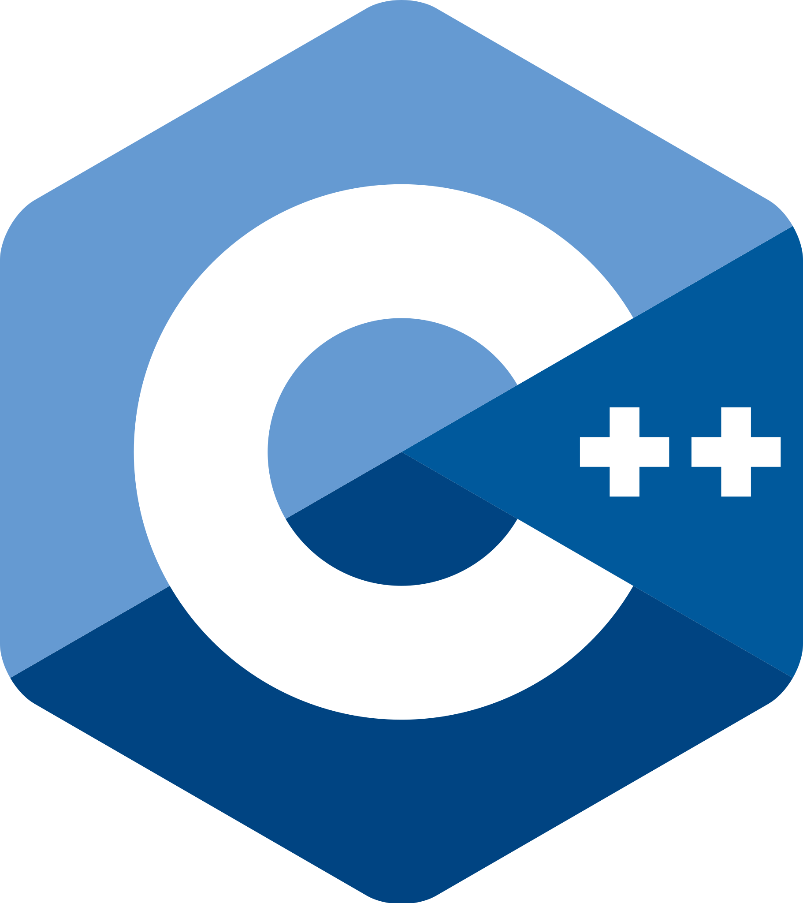

# C-plus-plus

In this repository, We will cover the basics of low level programming in C++. 

The concepts are organized in weeks, starting from week1 being the most basic concepts as the complexity increases gradually. 

<a href="./week1/README.md">Week one</a>

